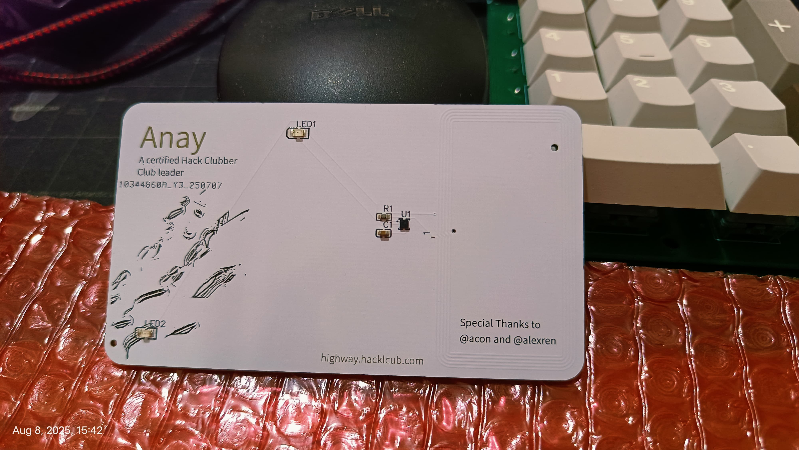
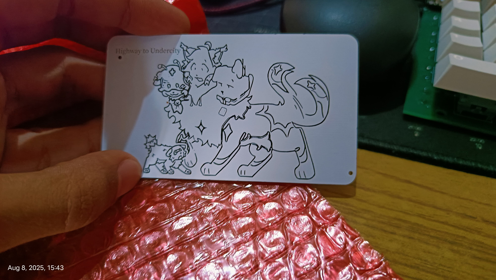

# Highway memory card
This is not jsut a normal but it is a card which is gonna help me to remember highway for rest of my life.

# Sch & PCB
This time I had to use EasyEDA I think it wasn't worst experience , I wasn't able to use KiCad because I had trouble uploading the librabries and the it wasn't detecting the footprints That I downloaded. So I decided to go with EaseEDA

#  Schematic

# PCB

# Front

# Back

# Youtube link
https://youtube.com/shorts/mWCdzmNfaxQ?si=8nd1UKdya1wmm3Lf
# BOM
|Part Name|Quantity|Cost|Link|
|-|-|-|-|
|NT3H2111W0FHKH|5|**$0.87**|https://jlcpcb.com/partdetail/NxpSemicon-NT3H2111W0FHKH/C710403|
|KT-0805Y|5|**$0.03**|https://jlcpcb.com/partdetail/Hubei_KentoElec-17_21SUYCTR8/C2296|
|0603WAF470JT5E|5|**$0.01**|[https://jlcpcb.com/partdetail/23909-0603WAF470JT5E/C23182](https://jlcpcb.com/partdetail/23909-0603WAF470JT5E/C23182)|
|CL10B224KA8NNNC|5|**$0.01**|https://jlcpcb.com/partdetail/21832-CL10B224KA8NNNC/C21120|
|Custom PCB|5|$2(By applying the coupon provided by highway.)|

## Total Pricing

The all the parts comes out to be $6.6, but there are gonna be cost of shipping so the Total Cost is ~$25

Cost of just parts comes to be around 7$
All together The total Cost is 25$
